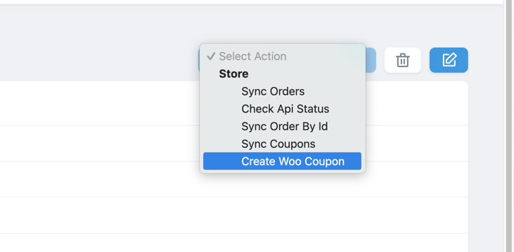
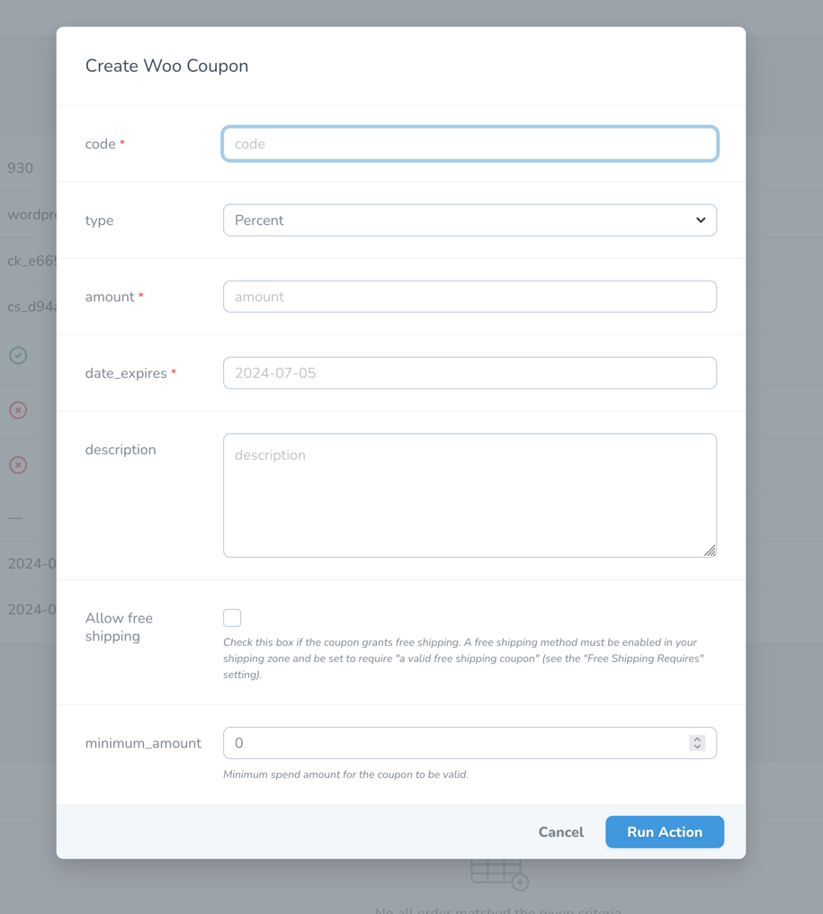

 # Manage Woocommerce coupons

::: warning
This feature require Woocommerce API key read and write permission.
:::

## Create coupon

You can visit the `Stores` page or in each individual store, select `Create Woo coupon` in the action dropdown.

Then input the information in the modal, then press `Run Action`

## Delete coupon

Simply press the trash icon on each coupon, it will delete the coupon from Woocommerce store also.