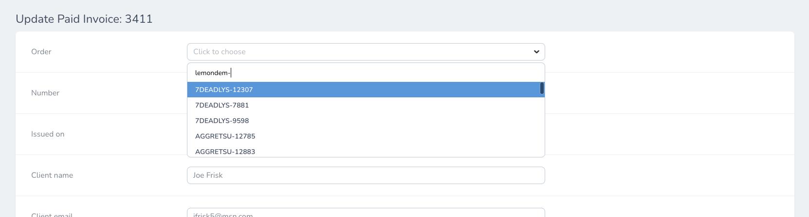

# Invoice functions

## Ignore an invoice

Trong trường hợp có invoice bị lỗi hoặc nhầm từ những store ko mong muốn, bạn có thể set ignore các invoice này để portal sẽ ko tự động mapping với order tương ứng.

Chỉ cần click vào nút `Ignore` màu đỏ hoặc chọn trong action menu. Các invoice này sẽ được chuyển sang danh sách `Ignored Invoices` trên sidebar.

## Manual map an invoice to an order

Sometimes hệ thống sẽ không map những đơn hàng với lỗi như sai số về giá trị đơn hàng giữa các hệ thống, hay nhầm tên customer. Khi đó bạn có thể map invoice với đơn hàng bằng cách thủ công như sau.

Chọn edit 1 `Paid` invoice và trạng thái `Unpaired` (chưa được map), sau đó tìm kiếm Order muốn map, sau đó chọn `Update Paid Invoice`.

