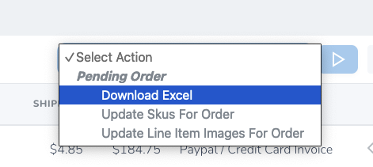

# Order operation

## Download Excel

Portal hỗ trợ việc export đơn hàng thành file excel dùng cho team vận hành xử lí.

Trên trang danh sách đơn hàng, bạn chọn các đơn hàng cần export, có thể sử dụng filter để lấy đúng các đơn hàng theo ngày cần thiết.

Sau khi chọn các đơn hàng cần export, sẽ có 1 select box hiện ra, bạn chọn `Download excel` và nhấn vào nút hình play button để execute action.

Thông tin file excel gồm có:

- `Website`: domain của store
- `Order date`: ngày tạo của đơn hàng
- `Paid date`
- `Order status`
- `Payment method`
- `Order number`
- `Email (billing)`
- `Phone (billing)`
- `Full name (shipping)`
- `Address 1 & 2 (shipping)`
- `City (shippping)`
- `State code (shipping)`
- `Postcode (shipping)`
- `Country code (shipping)`
- `Customer note (shipping)`
- `Image URL`
- `SKU`
- `Item name`
- `Product type`
- `Quantity`
- `Product current price`

Mỗi dòng trong file excel tương ứng với 1 `Line item`. Ví dụ 1 đơn hàng có 2 sản phẩm thì sẽ bao gồm 2 dòng.

## Import supplier shipment

Đối với việc vận hành đơn hàng, có 2 giai đoạn import thông tin đơn hàng, đầu tiên là thông tin từ supplier.

::: tip
Import supplier shipment và tracking shipment sử dụng file `csv` để hạn chế việc sai dữ liệu giữa hiển thị trên excel dữ liệu thật.
:::

### CSV file's columns

- `*Order Number`: mã đơn hàng
- `*Sku`: mã sku của sản phẩm (line item)
- `*Supplier`: mã code của supplier, VD: Taobao thì là TBO
- `*Supplier order number`: mã đơn từ supplier
- `Product type`: thông tin này có thể sửa lại từ file excel impor
- `*Production total`: chí phí sản xuất của sản phẩm, format dạng số, định dạng Mĩ, kí hiệu phân cách thập phân là `.` ví dụ $40 và 69 cent thì sẽ là `40.69`.
- `Link design`: link file design của sản phẩm
- `Private note`: internal note

::: warning
Mã đơn hàng và sku cần phải đúng với dữ liệu trên portal. 

Các cột có dấu * ở đầu là `required`.

Lần import sau có thể overwrite import trước (cho cùng 1 line item).
:::

## Import tracking shipment

Bước này dùng để import thông tin về tracking của từng sản phẩm vào portal, đồng thời cũng sẽ gửi email thông báo tới customer nếu sản phẩm đó có tracking number.

### CSV file's columns

- `*Order Number`: mã đơn hàng
- `*Sku`: mã sku của sản phẩm (line item)
- `*Tracking code`: mã tracking
- `*Delivery service`: tên dịch vụ vận chuyển
- `*Tracking web`: tên của tracking service (chú ý nhập đúng như trong setup)
