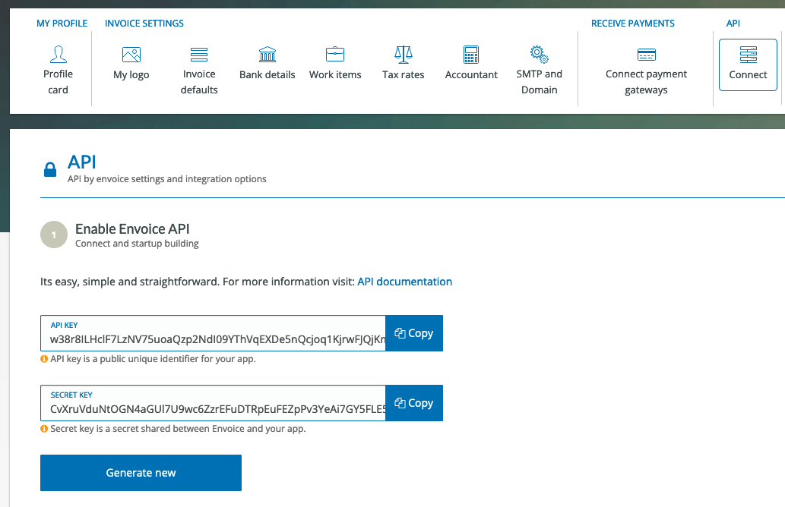
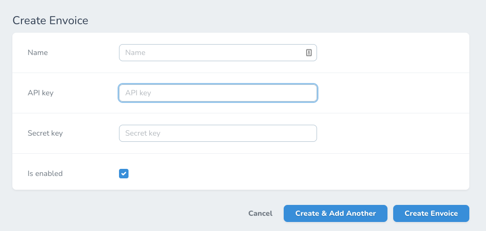
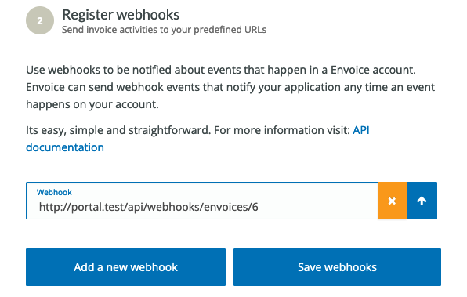

# Envoice

`Envoice` là dịch vụ bên ngoài [https://www.envoice.in/](https://www.envoice.in/) dùng cho việc thanh toán bằng invoice tích hợp trên Woocommerce.

Việc kết nối với Envoice giúp cho portal xác định được trạng thái thanh toán của đơn hàng trả sau.

Envoice sẽ cần được tích hợp cả `API` và `Webhooks`.

## Tạo API keys trên Envoice

Đăng nhập vào tài khoản Envoice của bạn, chọn `Account settings` -> `API` -> `Connect`.

Sau đó chuyển sang portal.

## Kết nối Envoice trên portal

Vào `Settings` -> `Envoice` -> `Create Envoice`.

- `Name`: nhập tên tài khoản Envoice hay cái gì cũng dc cho dễ nhớ, ví dụ: `For scam only` :tada:.
- `API key`: nhập Envoice api key.
- `Secrect key`: nhập Envoice secret key.
- `Is Enabled`: check vô.

Sau đó nhấn `Create Envoice`.

Sau khi kết nối với Envoice, sẽ được chuyển sang trang thông tin chi tiết của Envoice vừa tạo. Sau đó ta thực kết nối với Envoice đó thông qua `webhooks`.

## Setup webhooks trên Envoice

Sau khi tạo xong 1 Envoice, hoặc click chọn 1 envoice trong list envoice, ta sẽ xem được thông tin chi tiết nhu sau:

Copy url của phần `Webhook url`, sau đó chuyển sang trang `Api` của trên website `Envoice`.

Add new webhook với url tương ứng trên portal. -> `Save webhooks`.

::: warning
Mỗi `Envoice` sẽ có 1 url webhook khác nhau, chú ý nhập đúng nếu ko dữ liệu mapping sẽ bị sai.
:::

