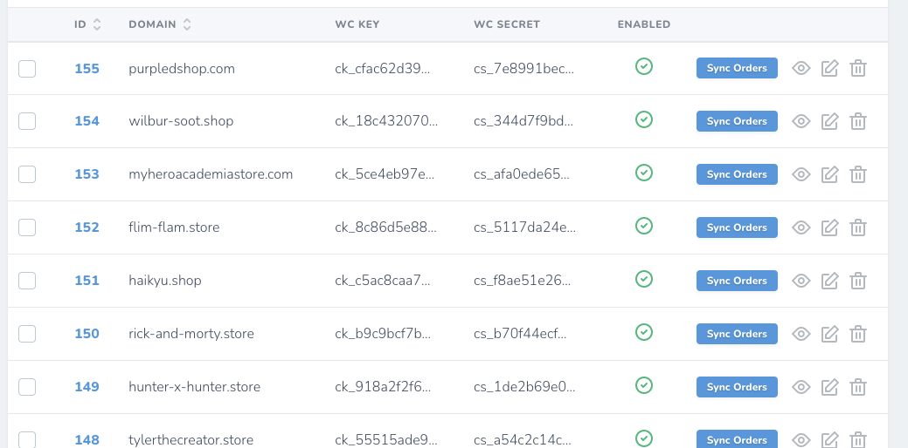
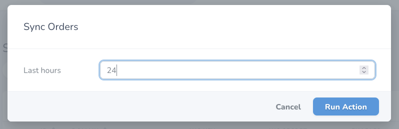
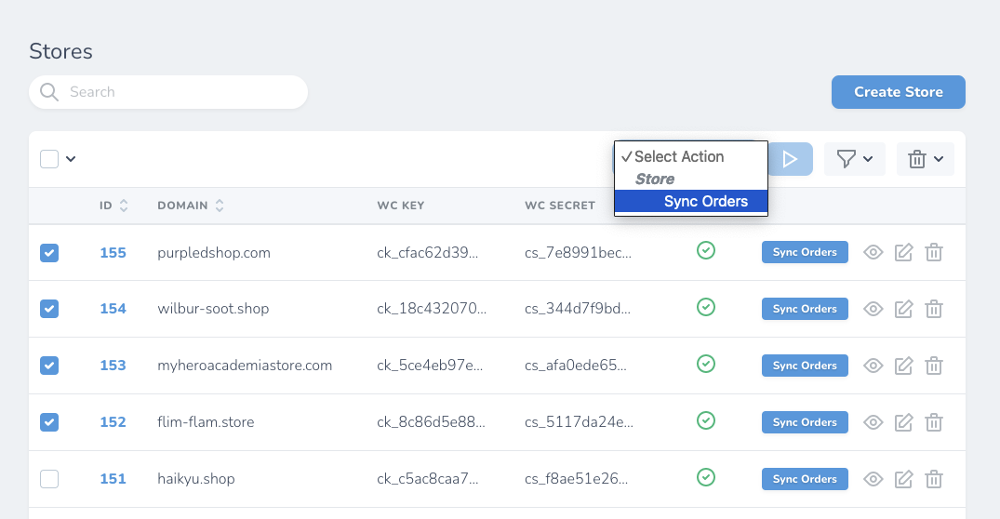

# Sync orders

## Background job

Portal tự động quét và lấy về thông tin orders từ các store Woocommerce theo lịch mỗi `2h` 1 lần. Mỗi lần trong khoảng thời gian 24 tiếng trước đó cho đến 1h gần nhất.

Ví dụ hiện tại là 7h sáng, các đơn hàng trong khoảng thời gian 7h sáng ngày hôm trước cho đến 6h sáng ngày hôm nay sẽ được quét.

::: warning
Nếu đơn hàng đã tồn tại trên portal thì sẽ không được cập nhật, hệ thống sẽ tự động bỏ qua.
:::

## Manual fetching orders

Portal hỗ trợ việc fetch đơn hàng thủ công trong trường hợp có lỗi thiếu đơn hoặc khi bạn mới nhập store lên portal lần đầu tiên.

### Fetching for single store

Click `Sync orders` button theo từng store trong danh sách.

Việc tính toán thời gian trong quá khứ là theo giờ, you have to calculate it yourself 🤣. Ví dụ muốn lấy các đơn hàng trong khoảng thời gian 1 tháng trước đó, thì cần nhập `720` vì `24 * 30 = 720`.

Việc đồng bộ sẽ xảy ra trên background của portal, thông tin đơn hàng mới (nếu có) sẽ xuất hiện khi job được thực hiện xong.

::: danger
Không nên nhập bừa kiểu 999999999 vì khi đó hệ thống thể có thể xảy ra lỗi :tada:.
:::

### Bulk fetching orders

Click chọn các store cần lấy thông tin đơn hàng (checkbox đầu dòng), sau đó chọn action `Sync orders`.

Sau đó nhập thời gian vào form.
