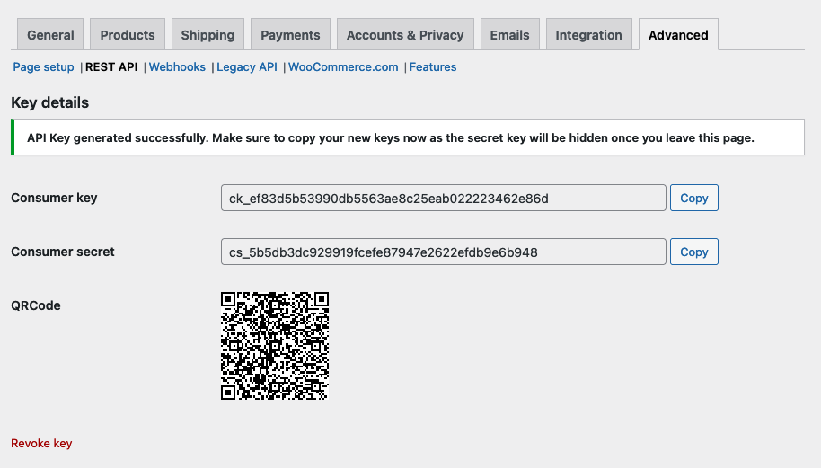
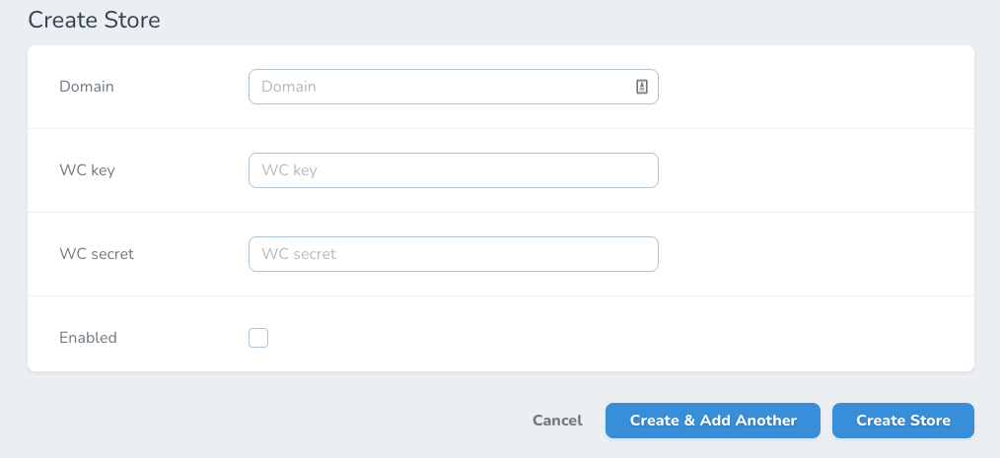

# Store

{{toc}}

Dể sử dụng portal, trước tiên bạn cần phải kết nối store wordpress với portal

## Tạo Woocommerce API

Đăng nhập vào admin của website wordpress, vd: `example.com/wp-admin`, trên menu của wordpress, chọn `Woocommerce -> Settings`, chọn tab `Advance`, chọn `REST API`.

Sau đó nhấn chọn tạo API key, trong form tạo phần `User` chọn user với quyền admin, hoặc user nào đó có quyền xem toàn bộ order của store, phần `Permissions` chọn `Read & Write`.

Sau khi tạo API sẽ nhận được thông tin của `Consumer key` và `Consumer secret`, lưu lại phần này và chuyển sang `portal`.

## Kết nối store trên portal

Trên portal, bạn vào `Settings` -> `Stores` -> chọn `Create store`.

- `Domain`: nhập thông tin domain của wordpress store, chỉ nhập tên domain, ko nhập `http://` hay `www` , ví dụ: `shopdiamon.com`
- `WC key`: nhập `Consumer key` của Woocommerce.
- `WC secret`: nhập `Consumer secret` của Woocommerce.
- `Enabled`: check vào!

Sau đó nhấn `Create store`.